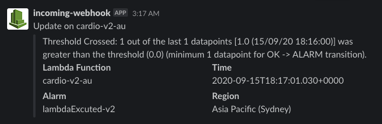

# cloudwatch-to-slack

Receive notifications from cloudwatch on Slack.

## Set up

1. Create SNS topic (ex. `cloudwatch-alarms`)
2. Deploy lambda script with SNS trigger (`./index.js`)
3. Add cloudWatch alarmas (ex. `reportErrors-lambda-name`)
   - Select metric (Lambda -> By Function Name -> Erros/Throttles/Invocations/Duration)
   - Set condition (ex. Errors is Greater than > 0)
   - Set notification (ex. in Alarm / Select created SNS)

